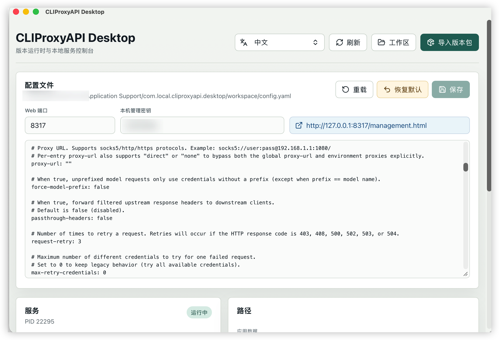
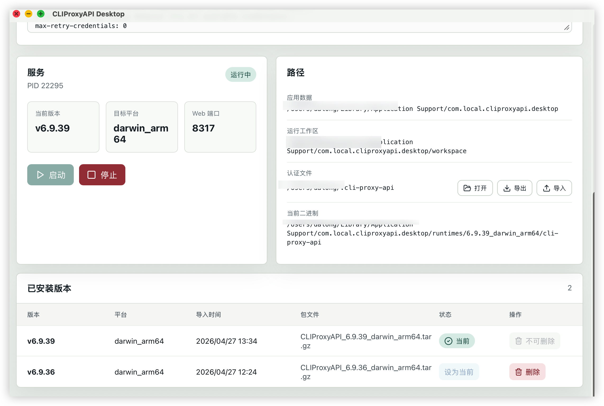

# CLIProxyAPI Desktop

[](https://github.com/vs2pk0/CLIProxyAPIClient/actions/workflows/release.yml)

<p align="center">
  
  
</p>

语言 / Languages:
[中文](#中文) |
[繁體中文（台灣）](#繁體中文台灣) |
[English](#english) |
[Русский](#русский)

## 中文

CLIProxyAPI Desktop 是基于 Tauri 的 CLIProxyAPI 桌面客户端，用来管理本机 CLIProxyAPI 运行时、配置文件、管理面板入口和认证文件。它适合想在本地稳定运行 CLIProxyAPI，但不想反复手动解压版本包、编辑 `config.yaml`、打开管理页面的用户。

### 主要功能

- 运行时版本管理：导入 `CLIProxyAPI_<version>_<os>_<arch>.tar.gz` 版本包，支持切换当前版本。
- 本地服务控制：一键启动、停止 CLIProxyAPI，并显示 PID、Web 端口、当前版本和运行路径。
- 配置快捷编辑：顶部提供 Web 端口、本机管理密钥快捷输入，同时保留完整 `config.yaml` 编辑器。
- 管理面板入口：服务运行后可直接打开 `management.html`。
- 默认配置恢复：每个导入版本都会缓存默认配置，可恢复当前版本对应的默认 `config.yaml`。
- 认证文件管理：显示认证文件目录，支持打开、导出为压缩包、从压缩包导入。
- 多语言界面：支持中文、繁體中文（台灣）、English、Русский，默认中文。
- 关闭保护：关闭应用前二次确认，确认后会先停止 CLIProxyAPI 服务再退出。
- 自动发布：推送到 `main` 或推送 `v*` 标签后，GitHub Actions 自动构建 macOS 与 Windows 客户端并发布到 Releases。

### 下载

前往 [Releases](https://github.com/vs2pk0/CLIProxyAPIClient/releases) 下载客户端：

- macOS Apple Silicon：下载 `.dmg`
- Windows x64：下载 `.msi` 或 `.exe`

说明：当前仓库内置的 CLIProxyAPI 运行时包是 `darwin_arm64`。Windows 客户端会正常打包和发布，首次使用时请导入 Windows 对应的 CLIProxyAPI 运行时包。

### 使用方法

1. 安装并打开 CLIProxyAPI Desktop。
2. 如果没有内置可用运行时，点击“导入版本包”，选择 CLIProxyAPI 的 `.tar.gz` 包。
3. 在“配置文件”区域填写 Web 端口和本机管理密钥，点击“保存”。
4. 点击“启动”，服务启动后可点击管理页地址打开浏览器。
5. 需要备份账号认证文件时，在“路径 > 认证文件”区域点击“导出”。
6. 需要恢复认证文件时，点击“导入”，选择之前导出的压缩包。

### 配置与密钥

本机管理密钥会保存在应用状态中，并在启动 CLIProxyAPI 时通过 `MANAGEMENT_PASSWORD` 环境变量传入。应用保存 `config.yaml` 时会清空 `remote-management.secret-key`，避免 CLIProxyAPI 启动后把明文密钥改写为 hash，导致下次输入不一致。

常用路径：

- 应用数据：系统应用数据目录下的 `com.local.cliproxyapi.desktop`
- 工作区：应用数据目录中的 `workspace`
- 配置文件：`workspace/config.yaml`
- 认证文件：默认读取配置里的 `auth-dir`，通常是 `~/.cli-proxy-api`

### 自动打包与发布

仓库包含 `.github/workflows/release.yml`：

- 推送到 `main`：自动创建 `build-<run_number>` 预发布版本。
- 推送 `v*` 标签：自动创建正式 Release。
- macOS 使用 `macos-14` runner 构建 Apple Silicon DMG。
- Windows 使用 `windows-latest` runner 构建 MSI/NSIS 安装包。

### 本地开发

```bash
npm ci
npm run build
npm run tauri:build
```

开发模式：

```bash
npm run tauri:dev
```

## 繁體中文（台灣）

CLIProxyAPI Desktop 是以 Tauri 建置的 CLIProxyAPI 桌面用戶端，用來管理本機 CLIProxyAPI 執行環境、設定檔、管理面板入口與認證檔案。它適合想在本機穩定執行 CLIProxyAPI，但不想反覆手動解壓版本包、編輯 `config.yaml`、開啟管理頁面的使用者。

### 主要功能

- 執行環境版本管理：匯入 `CLIProxyAPI_<version>_<os>_<arch>.tar.gz` 版本包，支援切換目前版本。
- 本機服務控制：一鍵啟動、停止 CLIProxyAPI，並顯示 PID、Web 連接埠、目前版本與執行路徑。
- 設定快捷編輯：上方提供 Web 連接埠、本機管理金鑰快捷輸入，同時保留完整 `config.yaml` 編輯器。
- 管理面板入口：服務執行後可直接開啟 `management.html`。
- 預設設定還原：每個匯入版本都會快取預設設定，可還原目前版本對應的預設 `config.yaml`。
- 認證檔案管理：顯示認證檔案目錄，支援開啟、匯出為壓縮包、從壓縮包匯入。
- 多語言介面：支援中文、繁體中文（台灣）、English、Русский，預設中文。
- 關閉保護：關閉應用程式前二次確認，確認後會先停止 CLIProxyAPI 服務再退出。
- 自動發布：推送到 `main` 或推送 `v*` 標籤後，GitHub Actions 自動建置 macOS 與 Windows 用戶端並發布到 Releases。

### 下載

前往 [Releases](https://github.com/vs2pk0/CLIProxyAPIClient/releases) 下載用戶端：

- macOS Apple Silicon：下載 `.dmg`
- Windows x64：下載 `.msi` 或 `.exe`

說明：目前倉庫內建的 CLIProxyAPI 執行環境包是 `darwin_arm64`。Windows 用戶端會正常建置與發布，首次使用時請匯入 Windows 對應的 CLIProxyAPI 執行環境包。

### 使用方法

1. 安裝並開啟 CLIProxyAPI Desktop。
2. 如果沒有內建可用執行環境，點擊「匯入版本包」，選擇 CLIProxyAPI 的 `.tar.gz` 包。
3. 在「設定檔」區域填寫 Web 連接埠與本機管理金鑰，點擊「儲存」。
4. 點擊「啟動」，服務啟動後可點擊管理頁位址開啟瀏覽器。
5. 需要備份帳號認證檔案時，在「路徑 > 認證檔案」區域點擊「匯出」。
6. 需要還原認證檔案時，點擊「匯入」，選擇之前匯出的壓縮包。

### 設定與金鑰

本機管理金鑰會儲存在應用程式狀態中，並在啟動 CLIProxyAPI 時透過 `MANAGEMENT_PASSWORD` 環境變數傳入。應用程式儲存 `config.yaml` 時會清空 `remote-management.secret-key`，避免 CLIProxyAPI 啟動後把明文金鑰改寫為 hash，導致下次輸入不一致。

常用路徑：

- 應用資料：系統應用資料目錄下的 `com.local.cliproxyapi.desktop`
- 工作區：應用資料目錄中的 `workspace`
- 設定檔：`workspace/config.yaml`
- 認證檔案：預設讀取設定裡的 `auth-dir`，通常是 `~/.cli-proxy-api`

### 自動打包與發布

倉庫包含 `.github/workflows/release.yml`：

- 推送到 `main`：自動建立 `build-<run_number>` 預發布版本。
- 推送 `v*` 標籤：自動建立正式 Release。
- macOS 使用 `macos-14` runner 建置 Apple Silicon DMG。
- Windows 使用 `windows-latest` runner 建置 MSI/NSIS 安裝包。

### 本機開發

```bash
npm ci
npm run build
npm run tauri:build
```

開發模式：

```bash
npm run tauri:dev
```

## English

CLIProxyAPI Desktop is a Tauri-based desktop client for CLIProxyAPI. It manages local CLIProxyAPI runtimes, the workspace configuration, the management panel URL, and auth files. It is useful when you want a stable local CLIProxyAPI service without manually unpacking every runtime package, editing `config.yaml`, and opening the management page by hand.

### Features

- Runtime version management: import `CLIProxyAPI_<version>_<os>_<arch>.tar.gz` packages and switch the active version.
- Local service control: start and stop CLIProxyAPI, with PID, Web port, active version, and paths displayed in the app.
- Quick config editing: edit the Web port and local management key from the top controls while keeping the full `config.yaml` editor available.
- Management panel shortcut: open `management.html` directly after the service is running.
- Restore default config: every imported version stores a default config snapshot, so the current version can restore its own default `config.yaml`.
- Auth file management: show the auth directory, open it, export JSON auth files as an archive, and import them back from an archive.
- Multilingual UI: Chinese, Traditional Chinese (Taiwan), English, and Russian. Chinese is the default.
- Close protection: closing the app asks for confirmation twice, then stops CLIProxyAPI before exiting.
- Automated releases: pushes to `main` or `v*` tags trigger GitHub Actions builds for macOS and Windows clients and publish them to Releases.

### Downloads

Download clients from [Releases](https://github.com/vs2pk0/CLIProxyAPIClient/releases):

- macOS Apple Silicon: `.dmg`
- Windows x64: `.msi` or `.exe`

Note: the currently bundled CLIProxyAPI runtime package is `darwin_arm64`. The Windows client is built and released, but on first use you should import a Windows CLIProxyAPI runtime package.

### Usage

1. Install and open CLIProxyAPI Desktop.
2. If no usable runtime is bundled, click "Import Version" and select a CLIProxyAPI `.tar.gz` package.
3. In the config area, fill in the Web port and local management key, then click "Save".
4. Click "Start"; after the service starts, click the management URL to open it in a browser.
5. To back up account auth files, use "Paths > Auth Files > Export".
6. To restore auth files, click "Import" and select a previously exported archive.

### Config And Key Handling

The local management key is stored in the app state and passed to CLIProxyAPI through the `MANAGEMENT_PASSWORD` environment variable when the service starts. When the app saves `config.yaml`, it clears `remote-management.secret-key` to avoid CLIProxyAPI rewriting plaintext keys as hashes and causing the next login input to mismatch.

Common paths:

- App data: `com.local.cliproxyapi.desktop` under the system app data directory
- Workspace: `workspace` under the app data directory
- Config file: `workspace/config.yaml`
- Auth files: read from `auth-dir` in the config, usually `~/.cli-proxy-api`

### Automated Builds And Releases

The repository includes `.github/workflows/release.yml`:

- Push to `main`: creates a `build-<run_number>` prerelease.
- Push a `v*` tag: creates a stable Release.
- macOS uses the `macos-14` runner to build an Apple Silicon DMG.
- Windows uses the `windows-latest` runner to build MSI/NSIS installers.

### Local Development

```bash
npm ci
npm run build
npm run tauri:build
```

Development mode:

```bash
npm run tauri:dev
```

## Русский

CLIProxyAPI Desktop — настольный клиент CLIProxyAPI на базе Tauri. Он управляет локальными версиями CLIProxyAPI, рабочей конфигурацией, ссылкой на панель управления и файлами авторизации. Приложение подходит, если вы хотите стабильно запускать CLIProxyAPI локально без ручной распаковки пакетов, редактирования `config.yaml` и открытия панели управления вручную.

### Возможности

- Управление версиями среды выполнения: импорт пакетов `CLIProxyAPI_<version>_<os>_<arch>.tar.gz` и переключение текущей версии.
- Управление локальным сервисом: запуск и остановка CLIProxyAPI с отображением PID, Web-порта, текущей версии и путей.
- Быстрое редактирование конфигурации: Web-порт и локальный ключ управления доступны сверху, полный редактор `config.yaml` остается на экране.
- Быстрый вход в панель управления: после запуска сервиса можно открыть `management.html` одним кликом.
- Сброс конфигурации: для каждой импортированной версии сохраняется снимок конфигурации по умолчанию.
- Управление файлами авторизации: отображение папки авторизации, открытие, экспорт JSON-файлов в архив и импорт из архива.
- Многоязычный интерфейс: китайский, традиционный китайский (Тайвань), английский и русский. По умолчанию используется китайский.
- Защита при закрытии: перед закрытием приложение дважды запрашивает подтверждение, затем останавливает CLIProxyAPI и выходит.
- Автоматические релизы: push в `main` или tag `v*` запускает GitHub Actions, собирает клиенты macOS и Windows и публикует их в Releases.

### Загрузка

Скачайте клиент в [Releases](https://github.com/vs2pk0/CLIProxyAPIClient/releases):

- macOS Apple Silicon: `.dmg`
- Windows x64: `.msi` или `.exe`

Примечание: сейчас встроенный пакет CLIProxyAPI предназначен для `darwin_arm64`. Windows-клиент собирается и публикуется, но при первом запуске следует импортировать Windows-пакет CLIProxyAPI.

### Использование

1. Установите и откройте CLIProxyAPI Desktop.
2. Если встроенной подходящей версии нет, нажмите "Import Version" и выберите пакет CLIProxyAPI `.tar.gz`.
3. В блоке конфигурации укажите Web-порт и локальный ключ управления, затем нажмите "Save".
4. Нажмите "Start"; после запуска сервиса откройте ссылку панели управления в браузере.
5. Для резервной копии файлов авторизации используйте "Paths > Auth Files > Export".
6. Для восстановления файлов авторизации нажмите "Import" и выберите ранее экспортированный архив.

### Конфигурация И Ключ

Локальный ключ управления хранится в состоянии приложения и передается CLIProxyAPI через переменную окружения `MANAGEMENT_PASSWORD` при запуске сервиса. При сохранении `config.yaml` приложение очищает `remote-management.secret-key`, чтобы CLIProxyAPI не заменял открытый ключ hash-значением и не вызывал расхождение при следующем входе.

Основные пути:

- Данные приложения: `com.local.cliproxyapi.desktop` в системной папке данных приложений
- Рабочая папка: `workspace` внутри папки данных приложения
- Файл конфигурации: `workspace/config.yaml`
- Файлы авторизации: путь берется из `auth-dir` в конфигурации, обычно `~/.cli-proxy-api`

### Автоматическая Сборка И Релизы

В репозитории есть `.github/workflows/release.yml`:

- Push в `main`: создается prerelease `build-<run_number>`.
- Push tag `v*`: создается стабильный Release.
- macOS использует runner `macos-14` для сборки Apple Silicon DMG.
- Windows использует runner `windows-latest` для сборки MSI/NSIS установщиков.

### Локальная Разработка

```bash
npm ci
npm run build
npm run tauri:build
```

Режим разработки:

```bash
npm run tauri:dev
```
